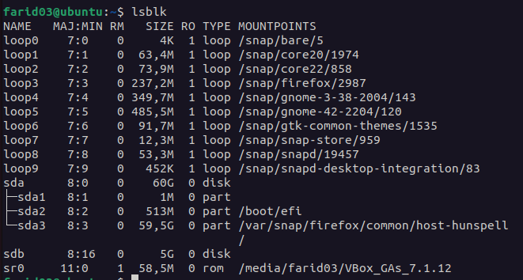
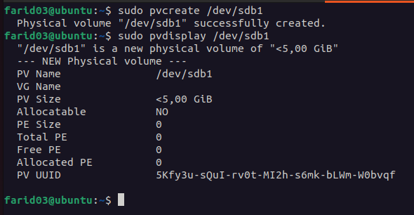
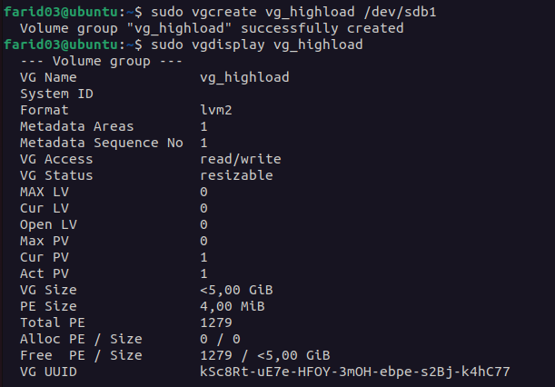
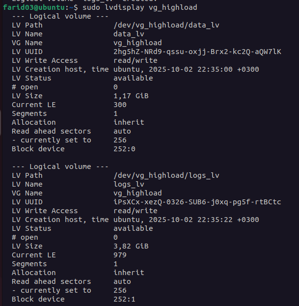
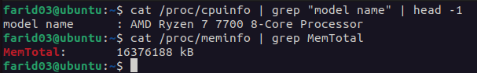
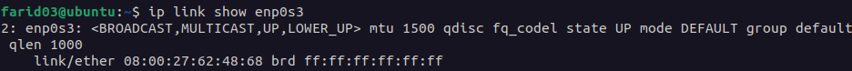

# Отчет по лабораторной работе №1: Linux Архитектура и файловые системы

---

## Задание 1. Kernel and Module Inspection

### 1.1. Продемонстрировать версию ядра вашей ОС

**Команда:**
```bash
uname -r
```


### 1.2. Показать все загруженные модули ядра

**Команда:**
```bash
lsmod
```


**Команда для получения информации о конкретном модуле:**
```bash
modinfo cdrom
```


### 1.3. Отключить автозагрузку модуля cdrom

**Шаг 1: Создание файла блокировки модуля**
```bash
sudo bash -c "echo 'blacklist cdrom' > /etc/modprobe.d/blacklist-cdrom.conf"
```

**Шаг 2: Проверка содержимого файла**
```bash
cat /etc/modprobe.d/blacklist-cdrom.conf
```

**Шаг 3: Выгрузка модуля из текущей сессии (если загружен)**
```bash
sudo modprobe -r cdrom
```

**Шаг 4: Обновление initramfs**
```bash
sudo update-initramfs -u
```

**Проверка после перезагрузки:**
```bash
lsmod | grep cdrom
```

**Результат выполнения команд:**


### 1.4. Найти и описать конфигурацию ядра

**Команда для просмотра конфигурации текущего ядра и поиска параметра CONFIG_XFS_FS:**

```bash
cat /boot/config-$(uname -r) | grep CONFIG_XFS_FS
```


**Описание параметра CONFIG_XFS_FS:**
- `CONFIG_XFS_FS=m` - XFS скомпилирован как модуль ядра
- `CONFIG_XFS_FS=y` - XFS встроен непосредственно в ядро
- `CONFIG_XFS_FS is not set` - поддержка XFS отключена

---

## Задание 2. Наблюдение за VFS

### 2.1. Анализ команды cat /etc/os-release > /dev/null с помощью strace

**Команда для трассировки:**
```bash
strace -e trace=openat,read,write,close cat /etc/os-release > /dev/null
```


**Анализ вывода:**

Открываемые файлы (openat):
- Системные библиотеки (ld.so, libc.so и т.д.)
- Файл `/etc/os-release` - целевой файл для чтения

Читаемые файлы (read):
- Чтение содержимого `/etc/os-release`
- Чтение конфигурационных файлов библиотек

Закрываемые файлы (close):
- Закрытие файловых дескрипторов после завершения операций

Объяснение отсутствия вызовов write:

Вызовы `write` отсутствуют в выводе по следующим причинам:

1. Перенаправление в /dev/null: Вывод команды `cat` перенаправляется в `/dev/null` - специальное псевдоустройство, которое игнорирует все записываемые данные.

2. Обработка на уровне shell: Перенаправление `> /dev/null` обрабатывается shell (bash/sh) ДО запуска команды `cat`. Shell открывает `/dev/null` и связывает его со стандартным выводом (STDOUT) процесса `cat`.

3. Фильтрация strace: Команда `strace` с параметром `-e trace=openat,read,write,close` отслеживает только системные вызовы указанных типов процесса `cat`. Сам `write` в `/dev/null` выполняется, но может быть оптимизирован или буферизован ядром.

4. Вывод в стандартный поток: Если запустить `strace` без фильтрации или с полным трассированием, можно увидеть вызовы `write(1, ...)`, где 1 - это файловый дескриптор STDOUT, перенаправленный в `/dev/null`.

---

## Задание 3. LVM Management

### 3.1. Добавление диска /dev/sdb размером 5GB

Создадим отдельный виртуальный диск для LVM в VirtualBox размером 5GB и подключим его:


**Проверка наличия диска:**
```bash
lsblk
```



### 3.2. Создание раздела на /dev/sdb

**Команда для запуска fdisk:**
```bash
sudo fdisk /dev/sdb
```


**Проверка созданного раздела:**
```bash
lsblk /dev/sdb
```


### 3.3. Создание Physical Volume (PV)

**Команда создания и проверки созданного PV:**
```bash
sudo pvcreate /dev/sdb1
sudo pvdisplay /dev/sdb1
```



### 3.4. Создание Volume Group (VG) с именем vg_highload

**Команда создания и проверки созданного VG:**
```bash
sudo vgcreate vg_highload /dev/sdb1
sudo vgdisplay vg_highload
```



### 3.5. Создание Logical Volumes

**Создание data_lv (1200 MiB) и logs_lv (оставшееся место):**
```bash
sudo lvcreate -L 1200M -n data_lv vg_highload
sudo lvcreate -l 100%FREE -n logs_lv vg_highload
```


**Проверка созданных LV:**
```bash
sudo lvdisplay vg_highload
```



### 3.6. Форматирование data_lv как ext4 и монтирование

**Форматирование в ext4:**
```bash
sudo mkfs.ext4 /dev/vg_highload/data_lv
```


**Создание точки монтирования, монтирование и проверка монтирования:**
```bash
sudo mkdir -p /mnt/app_data
sudo mount /dev/vg_highload/data_lv /mnt/app_data
df -h | grep app_data
mount | grep app_data
```


### 3.7. Форматирование logs_lv как xfs и монтирование

**Форматирование в XFS:**
```bash
sudo mkfs.xfs /dev/vg_highload/logs_lv
```


**Создание точки монтирования, монтирование и проверка:**
```bash
sudo mkdir -p /mnt/app_logs
sudo mount /dev/vg_highload/logs_lv /mnt/app_logs
df -h | grep app_logs
mount | grep app_logs
```


**Итоговая структура дисков с точками монтирования:**
```bash
lsblk
```


---

## Задание 4. Использование pseudo filesystem

### 4.1. Извлечение модели CPU и объёма памяти из /proc

**Модель CPU и объём памяти (в KiB):**
```bash
cat /proc/cpuinfo | grep "model name" | head -1
cat /proc/meminfo | grep MemTotal
```



---

### 4.2. Поиск Parent Process ID (PPid) текущего shell

**Команда:**
```bash
cat /proc/$$/status | grep PPid
```


`$$` - это специальная переменная в shell (bash/sh), которая содержит PID (Process ID) текущего процесса shell.

- `$$` раскрывается в числовой идентификатор процесса вашей текущей оболочки
- `/proc/$$` - это директория в procfs, содержащая информацию о текущем процессе shell
- `/proc/$$/status` - файл со статусной информацией о процессе

### 4.3. Определение настроек I/O scheduler для /dev/sda

**Команда:**
```bash
cat /sys/block/sda/queue/scheduler
```


Планировщик в квадратных скобках `[mq-deadline]` является активным
- Другие перечисленные планировщики доступны, но не активны
- Распространённые планировщики: `none`, `mq-deadline`, `bfq`, `kyber`

### 4.4. Определение размера MTU для основного сетевого интерфейса

**Определение имени основного сетевого интерфейса:**
```bash
ip route | grep default
```


**Просмотр MTU:**
```bash
ip link show enp0s3
```



Имеем значение MTU: 1500 байт.
MTU (Maximum Transmission Unit) - максимальный размер пакета, который может быть передан за одну операцию на канальном уровне.

---
