# Отчет по лабораторной работе №2: Системное администрирование Linux

---

## Задание 1. Systemd

Создать systemd-сервис для bash-скрипта с автоматическим перезапуском при падении.

### 1.1. Создание bash-скрипта

Создаем скрипт `/usr/local/bin/homework_service.sh`:

```bash
sudo nano /usr/local/bin/homework_service.sh
```

Содержимое скрипта:

```bash
#!/bin/bash

echo "My custom service has started."

while true; do
  echo "Service heartbeat: $(date)" >> /tmp/homework_service.log
  sleep 15
done
```

Делаем скрипт исполняемым:

```bash
sudo chmod +x /usr/local/bin/homework_service.sh
```

**Скриншот 1:** Создание и настройка прав скрипта


### 1.2. Создание systemd unit файла

Создаем systemd unit файл в `/etc/systemd/system/homework.service`:

```bash
sudo nano /etc/systemd/system/homework.service
```

Содержимое unit файла:

```ini
[Unit]
Description=Homework Service
After=network.target

[Service]
Type=simple
ExecStart=/usr/local/bin/homework_service.sh
Restart=always
RestartSec=15
StandardOutput=journal
StandardError=journal

[Install]
WantedBy=multi-user.target
```

**Пояснение параметров:**
- `Type=simple` - процесс запускается напрямую
- `Restart=always` - сервис перезапускается при любом завершении
- `RestartSec=15` - задержка 15 секунд перед перезапуском
- `WantedBy=multi-user.target` - сервис запускается в многопользовательском режиме

### 1.3. Запуск и проверка сервиса

Перезагружаем конфигурацию systemd:

```bash
sudo systemctl daemon-reload
```

Включаем автозапуск сервиса:

```bash
sudo systemctl enable homework.service
```

Запускаем сервис:

```bash
sudo systemctl start homework.service
```

Проверяем статус сервиса:

```bash
sudo systemctl status homework.service
```

**Скриншот 2:** Статус запущенного сервиса

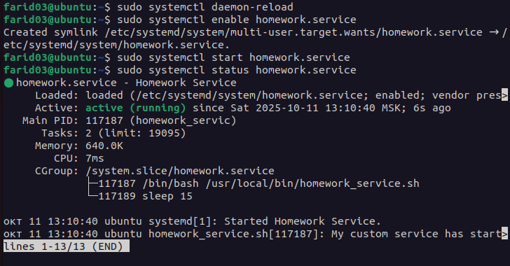

Проверяем лог-файл:

```bash
cat /tmp/homework_service.log
```

**Скриншот 3:** Содержимое лог-файла

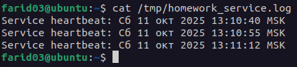

### 1.4. Проверка автоматического перезапуска

Находим PID процесса:

```bash
ps aux | grep homework_service.sh
```

Убиваем процесс:

```bash
sudo kill -9 <PID>
```

Ждем 15 секунд и снова проверяем статус:

```bash
sudo systemctl status homework.service
```

**Скриншот 4:** Статус сервиса после перезапуска

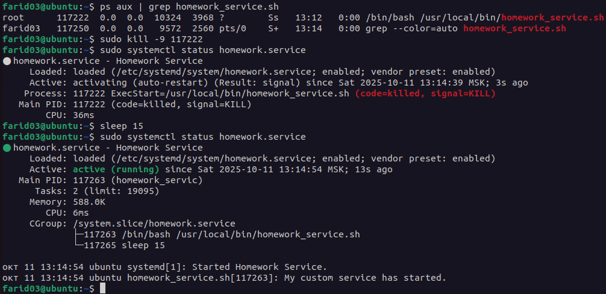

### 1.5. Анализ времени запуска systemd units

Выполняем команду для анализа времени загрузки и показываем топ-5 самых медленных unit'ов:

```bash
systemd-analyze
systemd-analyze blame | head -5
```

**Скриншот 5:** Общее время загрузки системы и топ-5 самых медленных unit'ов

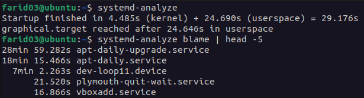

---

## Задание 2. Межпроцессное взаимодействие (IPC) с разделяемой памятью

Создать и проанализировать работу с разделяемой памятью (shared memory).

### 2.1. Создание программы для работы с разделяемой памятью

Создаем файл `shm_creator.c`:

```bash
nano shm_creator.c
```

Содержимое файла:

```c
#include <stdio.h>
#include <stdlib.h>
#include <sys/ipc.h>
#include <sys/shm.h>
#include <unistd.h>

int main() {
    key_t key = ftok("homework_key", 65); // Generate a unique key
    int shmid = shmget(key, 1024, 0666|IPC_CREAT); // Create 1KB segment
    if (shmid == -1) {
        perror("shmget");
        exit(1);
    }
    printf("Shared memory segment created.\n");
    printf("ID: %d\nKey: 0x%x\n", shmid, key);
    printf("Run 'ipcs -m' to see it. Process will exit in 60 seconds...\n");
    sleep(60);
    shmctl(shmid, IPC_RMID, NULL); // Clean up
    printf("Shared memory segment removed.\n");
    return 0;
}
```

### 2.2. Компиляция, подготовка и запуск

```bash
touch homework_key
gcc shm_creator.c -o shm_creator
./shm_creator
```

**Скриншот 6:** Вывод программы shm_creator

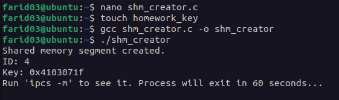

В течение 60 секунд, пока программа работает, открываем второй терминал и проверяем детальную информацию о конкретном сегменте:

```bash
ipcs -m -i <SHMID>
```

Где `<SHMID>` - ID сегмента из вывода предыдущей команды.

**Скриншот 7:** Детальная информация о сегменте разделяемой памяти

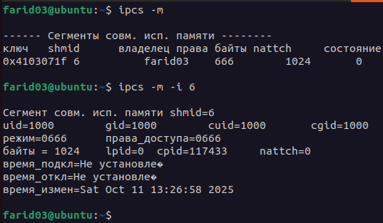

### Анализ вывода ipcs -m

**Ключевые поля вывода:**

- **key** - уникальный ключ сегмента, сгенерированный функцией `ftok()`
- **shmid** - идентификатор сегмента разделяемой памяти
- **owner** - владелец сегмента
- **perms** - права доступа (666 = rw-rw-rw-)
- **bytes** - размер сегмента (1024 байта = 1KB)
- **nattch** - количество процессов, подключенных к сегменту
- **status** - статус сегмента

**Анализ nattch (number of attached processes):**

В нашем случае `nattch` должен быть равен **0** (в нашем случае) или **1**, потому что:
- Если `nattch = 0`: процесс создал сегмент, но не подключился к нему через `shmat()`
- Если `nattch = 1`: процесс создал и подключился к сегменту

В данной программе мы создаем сегмент через `shmget()`, но не вызываем `shmat()` для подключения к нему, поэтому `nattch = 0`.

После завершения программы (через 60 секунд), сегмент автоматически удаляется вызовом `shmctl(shmid, IPC_RMID, NULL)`.

### Заключение по заданию 2

- Успешно создана программа для работы с разделяемой памятью
- Сегмент размером 1KB создается с правами 0666
- Команда `ipcs -m` позволяет просматривать все сегменты разделяемой памяти в системе
- Параметр `nattch` показывает количество процессов, подключенных к сегменту
- После завершения программы сегмент корректно удаляется из системы

---

## Задание 3. Анализ памяти процессов (VSZ vs RSS)

Проанализировать использование виртуальной (VSZ) и физической (RSS) памяти процессом.

### 3.1. Запуск тестового скрипта

В первом терминале запускаем Python-скрипт, который выделяет 250 МБ памяти:

```bash
python3 -c "print('Allocating memory...'); a = 'X' * (250 * 1024 * 1024); import time; print('Memory allocated. Sleeping...'); time.sleep(120);"
```

**Скриншот 8:** Запуск Python-скрипта с выделением памяти

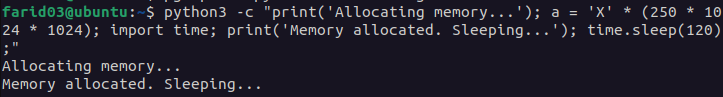

### 3.2. Поиск PID процесса

Во втором терминале находим PID запущенного Python-процесса и анализируем его память:

```bash
pgrep -f "python3.*Allocating"
ps -o pid,user,%mem,rss,vsz,comm -p <PID>
```

**Скриншот 9:** Вывод информации о памяти процесса

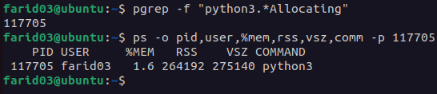

### Анализ результатов

**Определения:**

- **VSZ (Virtual Size)** - общий объем виртуальной памяти, выделенной процессу. Включает:
  - Код программы
  - Разделяемые библиотеки
  - Стек
  - Кучу (heap)
  - Отображенные файлы
  - Всю зарезервированную, но не обязательно используемую память

- **RSS (Resident Set Size)** - объем физической памяти (RAM), фактически используемой процессом в данный момент. Не включает:
  - Память, выгруженную в swap
  - Память, которая выделена, но еще не использована
  - Некоторые разделяемые библиотеки

**Почему VSZ больше RSS:**

1. **Разделяемые библиотеки**: VSZ включает весь размер загруженных библиотек Python (например, libc, libpython), но RSS содержит только реально используемые страницы этих библиотек в памяти.

2. **Виртуальная адресация**: VSZ показывает всю виртуальную адресную область процесса, включая зарезервированную, но не физически выделенную память.

3. **Интерпретатор Python**: Python требует значительного виртуального адресного пространства для своей работы, но не вся эта память физически резидентна в RAM.

4. **Ленивое выделение (lazy allocation)**: Операционная система может резервировать виртуальное пространство, но не выделять физическую память до фактического использования.

**Почему RSS имеет такое значение (и далеко не равен 0):**

1. **Выделенная строка**: Строка из 250 МБ символов 'X' реально хранится в физической памяти, поэтому RSS содержит примерно 250 МБ.

2. **Интерпретатор Python**: Сам интерпретатор Python занимает физическую память (обычно до 10 МБ).

3. **Системные библиотеки**: Загруженные библиотеки занимают физическую память.

4. **Внутренние структуры**: Стек, куча, метаданные Python также требуют физической памяти.

**Полученные значения:**
- VSZ: 275140 kB (250 МБ данных + интерпретатор + библиотеки + резерв)
- RSS: 264192 kB (250 МБ данных + интерпретатор + активные библиотеки)

---

## Задание 4. NUMA и cgroups

Изучить архитектуру NUMA и механизмы ограничения ресурсов через cgroups.

### 4.1. Анализ NUMA топологии

Проверяем количество NUMA-нод в системе:

```bash
numactl --hardware
```

**Скриншот 10:** Вывод информации о NUMA топологии

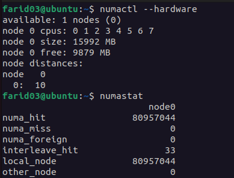

### 4.2. Запуск теста с ограничениями cgroups

Запускаем stress-тест с ограничениями через systemd:

```bash
sudo systemd-run --unit=highload-stress-test --slice=testing.slice \
--property="MemoryMax=150M" \
--property="CPUWeight=100" \
stress --cpu 1 --vm 1 --vm-bytes 300M --timeout 30s
```

**Пояснение параметров команды:**

- `systemd-run` - запуск транзиентного systemd unit
- `--unit=highload-stress-test` - имя создаваемого unit
- `--slice=testing.slice` - помещаем в slice "testing" для группировки
- `--property="MemoryMax=150M"` - жесткое ограничение памяти в 150 МБ
- `--property="CPUWeight=100"` - приоритет использования CPU (от 1 до 10000)
- `stress --cpu 1` - создать 1 CPU-intensive процесс
- `--vm 1` - создать 1 процесс, работающий с памятью
- `--vm-bytes 300M` - каждый процесс пытается выделить 300 МБ
- `--timeout 30s` - тест длится 30 секунд

**Скриншот 11:** Запуск stress-теста с ограничениями

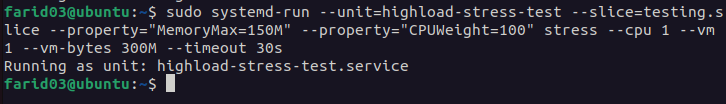

### 4.3. Мониторинг testing.slice

В соседнем терминале наблюдаем за cgroup:

```bash
watch -n 1 'systemd-cgls /testing.slice'
```

**Скриншот 12:** Вывод systemd-cgls для testing.slice

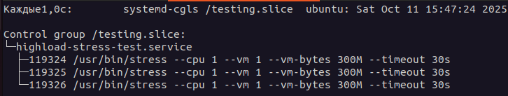

Проверяем статус unit:

```bash
sudo systemctl status highload-stress-test
```

**Скриншот 13:** Статус stress-теста

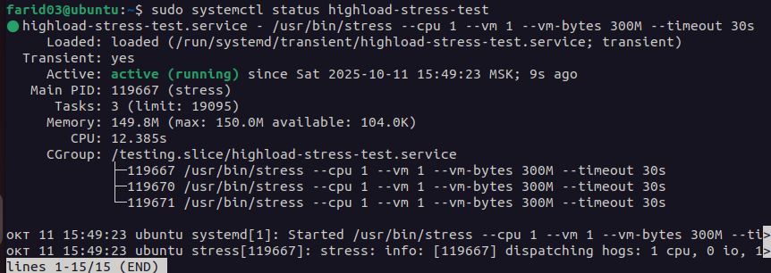

Просматриваем использование памяти в cgroup:

```bash
systemd-cgtop
```

**Скриншот 14:** Мониторинг ресурсов через systemd-cgtop

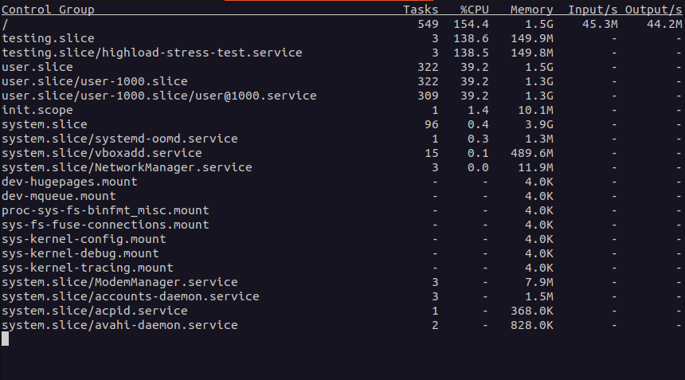

### 4.4. Анализ работы и ответы на вопросы по заданию

**Вопрос 1:** Будет ли работать тест если мы запрашиваем 300М оперативной памяти, а ограничиваем 150М?

Нет, тест не будет работать нормально. 
Процесс stress попытается выделить 300 МБ памяти, но при достижении лимита в 150 МБ будет принудительно завершен механизмом OOM Killer 
ядра Linux. Systemd unit перейдет в состояние failed.

---

**Вопрос 2:** Превысило ли использование памяти 150М в **testing.slice**? Что происходит с процессом при превышении?

Ответ: Нет, использование памяти не превысит 150 МБ. Механизм cgroups v2 жестко контролирует лимит:
При приближении к лимиту ядро пытается освободить память (через механизмы reclaim)
Если освободить память невозможно, процесс убивается до превышения лимита
Счетчик памяти в cgroup всегда остается ≤ 150 МБ

Что происходит с процессом:
Процесс получает сигнал SIGKILL и немедленно завершается
В журнале появляются записи об OOM событии
Systemd отмечает unit как failed с кодом выхода, указывающим на принудительное завершение

При использовании разных значений:
- MemoryMax=350M: процесс успешно выполняется все 30 секунд
- MemoryMax=200M: процесс может будет убит спустя несколько секунд
- MemoryMax=50M: процесс убивается практически сразу

---

Вопрос 3: Что делает и для чего можно использовать MemoryMax и CPUWeight?
**MemoryMax:**
- Что делает: 
  - Устанавливает жесткий (hard) лимит на использование оперативной памяти в cgroup. При достижении лимита активируется OOM killer
- Для чего используется: 
  - Предотвращение утечек памяти и защита системы от перегрузки 
  - Изоляция сервисов и контейнеров друг от друга 
  - Обеспечение предсказуемого распределения ресурсов

**CPUWeight:**
- Что делает: 
  - Определяет относительный приоритет доступа к CPU (значения от 1 до 10000, по умолчанию 100). Работает при конкуренции за ресурсы
- Для чего используется:
  - Приоритизация важных сервисов (веб-сервер: weight=1000)
  - Ограничение фоновых задач (бэкапы: weight=50)
  - Обеспечение Quality of Service (QoS) между разными приложениями
  - Пример: Процесс с CPUWeight=1000 получит в 10 раз больше процессорного времени, чем процесс с CPUWeight=100, когда оба конкурируют за CPU.
