# Отчет по лабораторной работе №3: Сетевые технологии и маршрутизация

---

## Задание 1. Анализ состояний TCP-соединений

### 1.1. Запуск Python HTTP сервера

Запускаем HTTP сервер на порту 8080 и проверяем слушающий сокет:

```bash
python3 -m http.server 8080 &
ss -tlnp | grep 8080
```

**Скриншот 1:** Запуск HTTP сервера

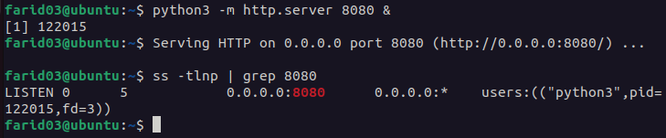


### 1.3. Подключение к серверу через curl

Отправим запрос к серверу:

```bash
curl http://localhost:8080
```

**Скриншот 2:** Результат запроса через curl

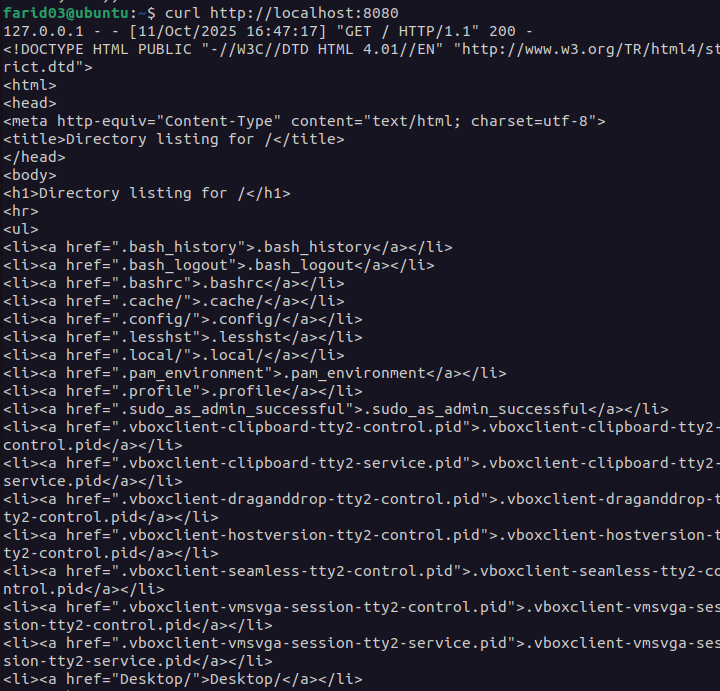

### 1.4. Анализ состояния TCP-сокетов

Для анализа всех состояний TCP-соединений на порту 8080:

```bash
ss -tan | grep 8080
```

Где:
- `-a` — показать все сокеты (слушающие и установленные)
- `-n` — числовой формат

**Скриншот 3:** Состояния TCP-сокетов для порта 8080

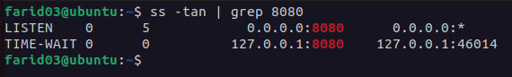

### 1.5. Объяснение состояния TIME-WAIT

#### Что такое TIME-WAIT?

`TIME-WAIT` — это состояние TCP-соединения, в которое переходит сторона, инициировавшая закрытие соединения (отправившая первый FIN-пакет), после получения финального ACK.

#### Роль состояния TIME-WAIT

Состояние TIME-WAIT выполняет две важные функции:

1. **Надежное завершение соединения**: Обеспечивает, что последний ACK-пакет будет доставлен. Если ACK потеряется, удаленная сторона повторно отправит FIN, и сокет в состоянии TIME-WAIT сможет повторно отправить ACK.

2. **Предотвращение конфликтов с новыми соединениями**: Гарантирует, что задержавшиеся пакеты из старого соединения не будут интерпретированы как часть нового соединения с теми же параметрами (IP-адреса и порты).

#### Почему TIME-WAIT нельзя удалить?

Сокет в состоянии TIME-WAIT нельзя удалить вручную по следующим причинам:

- Стандарт TCP (RFC 793) требует, чтобы соединение оставалось в этом состоянии в течение 2*MSL (Maximum Segment Lifetime), обычно 60-120 секунд
- Это необходимо для корректной работы протокола TCP
- Преждевременное удаление может привести к сбоям в передаче данных

#### Проблемы от большого количества TIME-WAIT сокетов

Большое количество сокетов в состоянии TIME-WAIT может привести к следующим проблемам:

1. **Исчерпание доступных портов**: На клиентской стороне доступно ограниченное количество эфемерных портов (обычно 28232 на Linux по умолчанию). Если все порты заняты TIME-WAIT сокетами, новые исходящие соединения создать невозможно.

2. **Потребление памяти**: Каждый сокет занимает память ядра. При миллионах соединений это может стать существенной проблемой.

3. **Накладные расходы на обработку**: Ядро должно обрабатывать и отслеживать все эти сокеты.

---

## Задание 2. Динамическая маршрутизация с BIRD

### 2.1. Создание dummy-интерфейса service_0

Создаем dummy-интерфейс с адресом 192.168.14.88/32:

```bash
# Загрузка модуля dummy
sudo modprobe dummy

# Создание интерфейса
sudo ip link add service_0 type dummy

# Назначение IP-адреса
sudo ip addr add 192.168.14.88/32 dev service_0

# Включение интерфейса
sudo ip link set service_0 up

# Проверка созданного интерфейса
ip addr show service_0
```

**Скриншот 4:** Создание и настройка интерфейса service_0

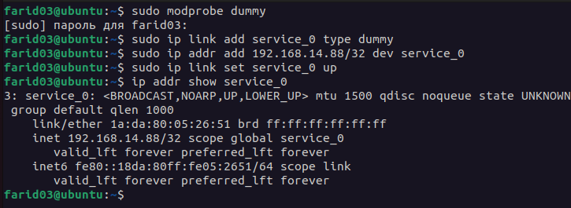

### 2.2. Установка и настройка BIRD

Создание конфигурационного файла BIRD:

```bash
sudo nano /etc/bird/bird.conf
```

Содержимое конфигурационного файла:

```
# Конфигурация BIRD для RIP v2

# ID маршрутизатора
router id 192.168.14.88;

# Протокол device для мониторинга интерфейсов
protocol device {
    scan time 10;
}

# Протокол kernel для синхронизации с таблицей маршрутизации ядра
protocol kernel {
    ipv4 {
        export all;
        import all;
    };
}

# Протокол direct для получения информации о напрямую подключенных сетях
protocol direct {
    ipv4;
    interface "service_*";
}

# Настройка RIP v2
protocol rip my_rip {
    ipv4 {
        import all;
        export where (net ~ 192.168.14.0/24) && (net.len = 32) && ifname ~ "service_*";
    };
    
    interface "enp0s3" { 
        version 2;
        authentication none;
    };
}
```

Проверка конфигурации и запуск BIRD:

```bash
# Проверка синтаксиса конфигурации
sudo bird -p -c /etc/bird/bird.conf

# Перезапуск BIRD
sudo systemctl restart bird

# Проверка статуса
sudo systemctl status bird
```

**Скриншот 5:** Настройка и запуск BIRD

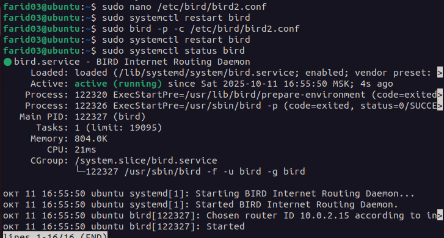

### 2.3. Создание дополнительных интерфейсов

Создаем три дополнительных интерфейса:

```bash
# service_1 с адресом 192.168.14.1/30
sudo ip link add service_1 type dummy
sudo ip addr add 192.168.14.1/30 dev service_1
sudo ip link set service_1 up

# service_2 с адресом 192.168.10.4/32
sudo ip link add service_2 type dummy
sudo ip addr add 192.168.10.4/32 dev service_2
sudo ip link set service_2 up

# srv_1 с адресом 192.168.14.4/32
sudo ip link add srv_1 type dummy
sudo ip addr add 192.168.14.4/32 dev srv_1
sudo ip link set srv_1 up

# Проверка всех созданных интерфейсов
ip addr show | grep -A 2 "service_\|srv_"
```

**Скриншот 6:** Создание дополнительных интерфейсов

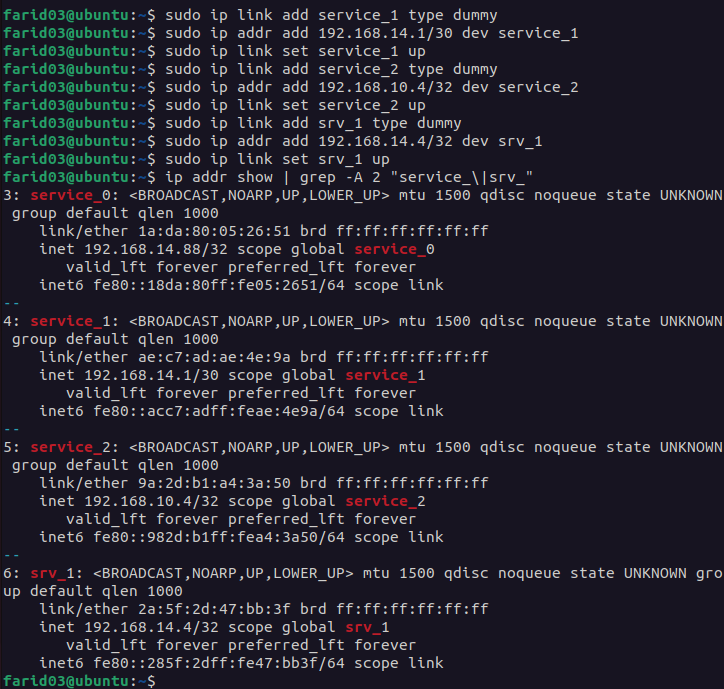

### 2.4. Проверка анонсируемых адресов с помощью tcpdump

Запускаем tcpdump для отслеживания RIP-пакетов:

```bash
# Запуск tcpdump для мониторинга RIP трафика
sudo tcpdump -i enp0s3, -vvv udp port 520 > log.txt &
```

Подождем 30 секунд, затем проверим лог:

**Скриншот 7:** Вывод tcpdump с RIP-анонсами


### 2.5. Проверка конфигурации BIRD

Подключение к консоли BIRD для проверки:

```bash
sudo birdc
```

Команды в консоли BIRD:

```
# Показать все протоколы
show protocols

# Показать все маршруты
show route

# Показать маршруты, экспортируемые в RIP
show route export my_rip

```

**Скриншот 8:** Вывод команд из консоли BIRD

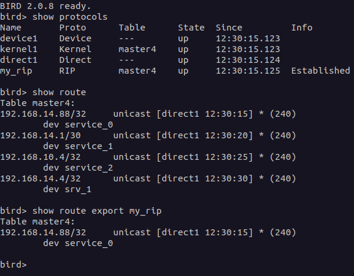

Как и ожидалось - только 192.168.14.88/32 попадает под фильтр.

---

## Задание 3. Настройка фаервола / Host Firewalling

### 3.1. Создание правила блокировки порта 8080 (iptables)

Вариант с использованием **iptables**:

```bash
# Просмотр текущих правил
sudo iptables -L -n -v

# Блокировка входящих соединений на порт 8080
sudo iptables -A INPUT -p tcp --dport 8080 -j REJECT --reject-with tcp-reset

# Проверка правил
sudo iptables -L INPUT -n -v --line-numbers
```

**Скриншот 9:** Создание правила iptables

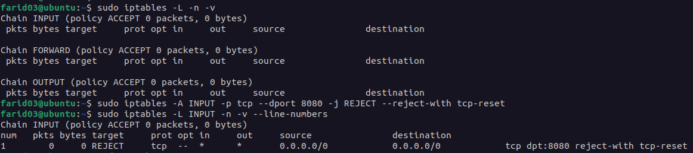

### 3.2. Запуск веб-сервера и тестирование

Запуск веб-сервера на Python:

```bash
python3 -m http.server 8080
```

**Скриншот 14:** Запущенный веб-сервер

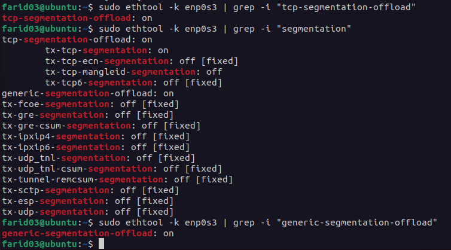

### 3.3. Демонстрация работы firewall с tcpdump

В одном терминале запускаем tcpdump:

```bash
# Мониторинг трафика на порту 8080
sudo tcpdump -i lo -nn port 8080 -v
```

В другом терминале пытаемся подключиться:

```bash
curl http://localhost:8080
```

**Скриншот 10:** Вывод tcpdump с блокированными пакетами

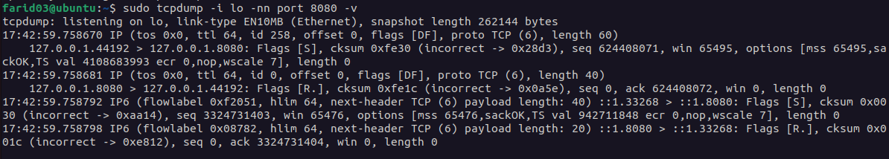

**Скриншот 11:** Ошибка подключения curl

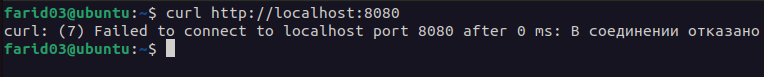

---

## Задание 4. Аппаратное ускорение сетевого трафика (offloading)

### 4.1. Определение сетевого адаптера

Сначала определяем имя сетевого адаптера:

```bash
ip link show
```

**Скриншот 12:** Список сетевых интерфейсов

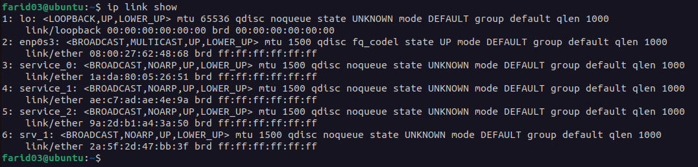

### 4.2. Исследование offload возможностей

Используем ethtool для проверки возможностей сетевого адаптера:

```bash
# Базовая информация об интерфейсе
sudo ethtool enp0s3

# Просмотр offload функций
sudo ethtool -k enp0s3
```

**Скриншот 13:** Вывод ethtool -k для сетевого адаптера

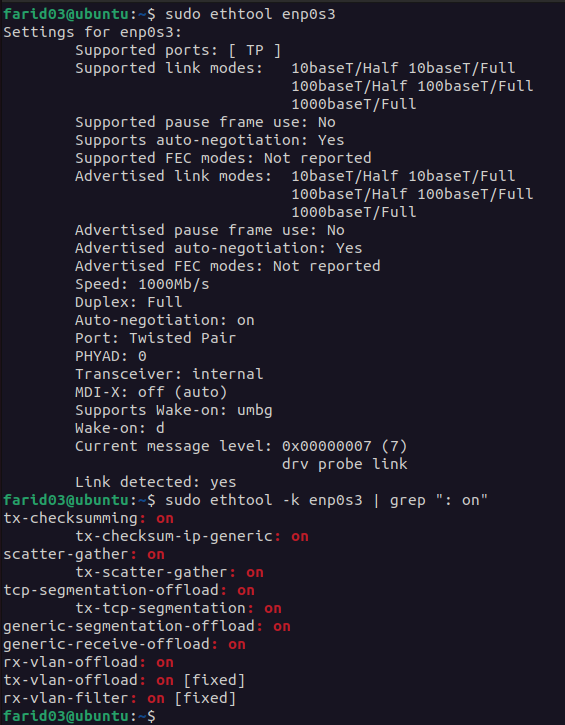

### 4.3. Проверка TCP segmentation offload

Для проверки конкретно TCP segmentation offload (TSO):

```bash
# Проверка TSO
sudo ethtool -k enp0s3 | grep -i "tcp-segmentation-offload"

# Проверка всех связанных с сегментацией функций
sudo ethtool -k enp0s3 | grep -i "segmentation"

# Проверка Generic Segmentation Offload (GSO)
sudo ethtool -k enp0s3 | grep -i "generic-segmentation-offload"
```

**Скриншот 13:** Статус TCP segmentation offload


### 4.4. Объяснение TCP Segmentation Offload (TSO)

TSO (TCP Segmentation Offload) — это технология, которая переносит работу по разделению больших TCP-пакетов с процессора на сетевую карту.

#### Как работает?

Обычно когда приложение отправляет большой блок данных, процессор должен разбить его на маленькие пакеты (обычно по 1460 байт) и для каждого создать TCP и IP заголовки. Это занимает ресурсы процессора.

С TSO процессор создает один большой пакет (до 64KB) и отправляет его сетевой карте. Уже сама карта аппаратно делит этот пакет на нужные сегменты и добавляет к каждому необходимые заголовки. Получается, что процессор делает меньше работы.

#### Зачем это нужно?

Главная задача TSO — снизить нагрузку на процессор и увеличить пропускную способность сети. Вместо того чтобы обрабатывать каждый маленький пакет отдельно, процессор работает с одним большим блоком данных, а остальное делает железо. Это особенно важно для высокоскоростных сетей и серверов с большим трафиком.

Еще плюсы: меньше прерываний для процессора, меньше операций копирования данных, быстрее общая работа сети.

Похожие технологии: GSO (программная версия), GRO (для приема пакетов), LRO (аппаратная версия GRO).

