# Отчет по лабораторной работе №4: Балансировка нагрузки

---

## Подготовка окружения

Установка необходимых пакетов:

```bash
sudo apt update && sudo apt install -y ipvsadm nginx curl dnsmasq python3
```

**Скриншот 1:** Установка пакетов

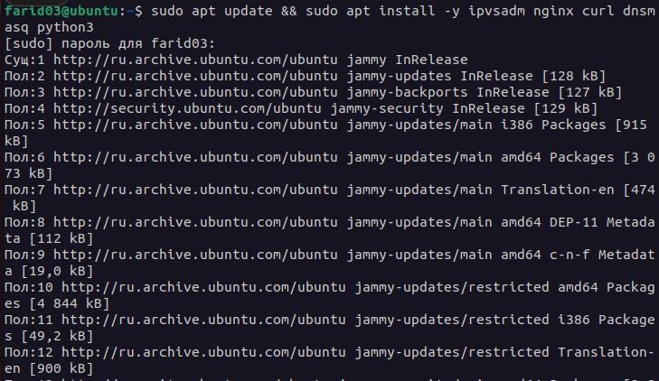

---

## Задание 1. Создание Server Pool для backend

### 1.1. Создание структуры каталогов

Создаем директории для двух бэкенд-серверов:

```bash
mkdir -p ~/backend1 ~/backend2
```

### 1.2. Создание HTML файлов

Создаем index.html для первого сервера:

```bash
echo "<h1>Response from Backend Server 1</h1>" > ~/backend1/index.html
```

Создаем index.html для второго сервера:

```bash
echo "<h2>*** Response from Backend Server 2 ***</h2>" > ~/backend2/index.html
```

**Скриншот 2:** Содержимое созданных файлов

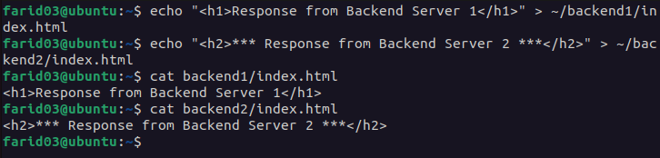

### 1.3. Запуск HTTP серверов

Запускаем первый сервер на порту 8081:

```bash
cd ~/backend1
python3 -m http.server 8081 &
```

Запускаем второй сервер на порту 8082:

```bash
cd ~/backend2
python3 -m http.server 8082 &
```

Проверка работы серверов:

```bash
curl http://localhost:8081
curl http://localhost:8082
```

**Скриншот 3:** Запуск и проверка HTTP серверов

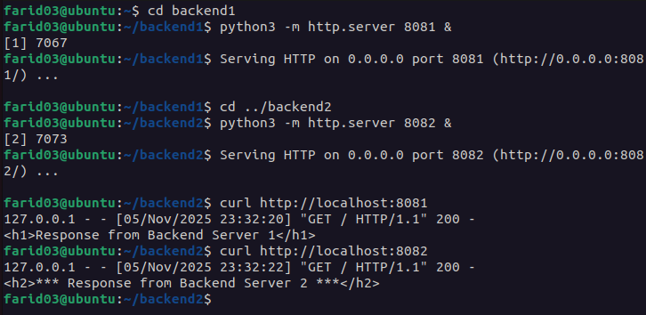

---

## Задание 2. DNS Load Balancing с помощью dnsmasq

### 2.1. Настройка dnsmasq

Создаем конфигурационный файл для dnsmasq:

```bash
sudo nano /etc/dnsmasq.d/loadbalancing.conf
```

Добавляем A-записи:

```
address=/my-awesome-highload-app.local/127.0.0.1
address=/my-awesome-highload-app.local/127.0.0.2
```

**Скриншот 4:** Конфигурация dnsmasq

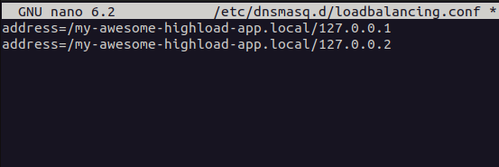

### 2.2. Запуск dnsmasq

Перезапускаем dnsmasq:

```bash
sudo systemctl restart dnsmasq
sudo systemctl status dnsmasq
```

**Скриншот 5:** Статус dnsmasq

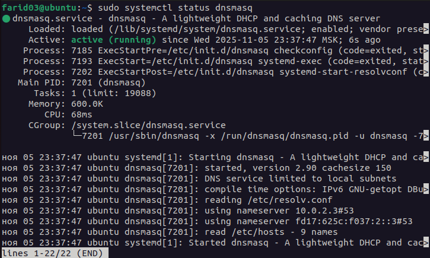

### 2.3. Проверка DNS резолва

Используем dig для резолва доменного имени:

```bash
dig @127.0.0.1 my-awesome-highload-app.local
```

**Скриншот 6:** Результат dig запроса

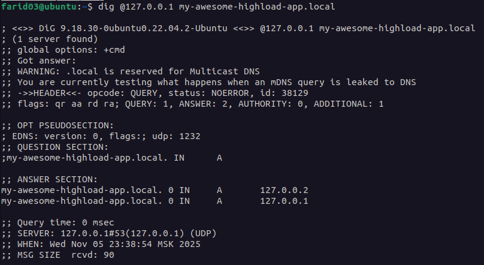

Повторяем запрос несколько раз, чтобы увидеть порядок ответов:

```bash
dig @127.0.0.1 my-awesome-highload-app.local +short
dig @127.0.0.1 my-awesome-highload-app.local +short
dig @127.0.0.1 my-awesome-highload-app.local +short
```

**Скриншот 7:** Множественные запросы

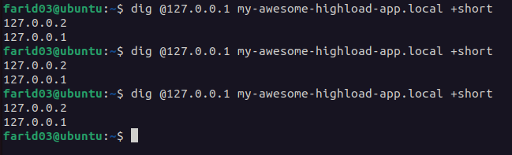

### 2.4. Анализ поведения при сбое сервера

**Что произойдет, если backend2 сервер сломается?**

При использовании DNS балансировки dnsmasq будет продолжать возвращать оба IP-адреса (127.0.0.1 и 127.0.0.2), даже если один из серверов недоступен. DNS не проверяет доступность хостов - он только отдает записи из конфигурации.

Проблема: клиенты будут получать IP недоступного сервера, что приведет к ошибкам подключения. DNS балансировка не предоставляет механизма health check, поэтому половина запросов будет падать.

Это основной недостаток DNS балансировки - отсутствие мониторинга состояния серверов.

---

## Задание 3. Балансировка Layer 4 с помощью IPVS

### 3.1. Создание dummy интерфейса

Загружаем модуль dummy и создаем интерфейс:

```bash
sudo modprobe dummy
sudo ip link add dummy1 type dummy
sudo ip addr add 192.168.100.1/32 dev dummy1
sudo ip link set dummy1 up
```

Проверка созданного интерфейса:

```bash
ip addr show dummy1
```

**Скриншот 8:** Создание dummy интерфейса

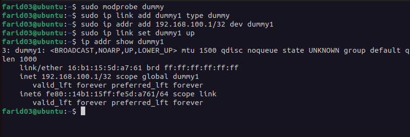

### 3.2. Настройка IPVS

Создаем виртуальный сервер с round-robin балансировкой:

```bash
sudo ipvsadm -A -t 192.168.100.1:80 -s rr

sudo ipvsadm -a -t 192.168.100.1:80 -r 127.0.0.1:8081 -m
sudo ipvsadm -a -t 192.168.100.1:80 -r 127.0.0.1:8082 -m
```

Где:
- `-A` — добавить виртуальный сервис
- `-t` — TCP протокол
- `-s rr` — round-robin алгоритм балансировки
- `-a` — добавить реальный сервер
- `-r` — адрес реального сервера
- `-m` — masquerading (NAT)

Просмотр конфигурации IPVS:

```bash
sudo ipvsadm -L -n
```

**Скриншот 9:** Настройка IPVS

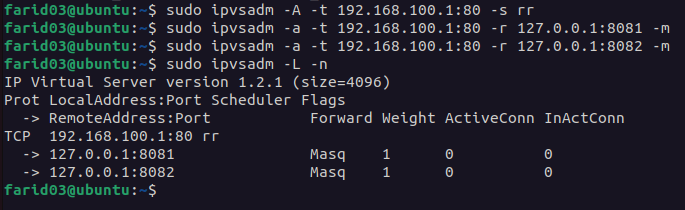

### 3.3. Тестирование балансировки

Выполняем несколько запросов через curl:

```bash
curl http://192.168.100.1
curl http://192.168.100.1
curl http://192.168.100.1
curl http://192.168.100.1
```

**Скриншот 10:** Результаты запросов через IPVS

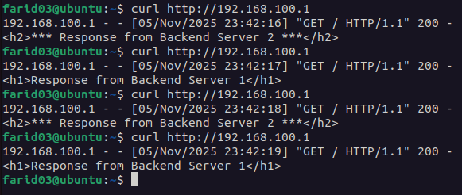

Просмотр статистики IPVS:

```bash
sudo ipvsadm -L -n --stats
```

**Скриншот 11:** Статистика IPVS

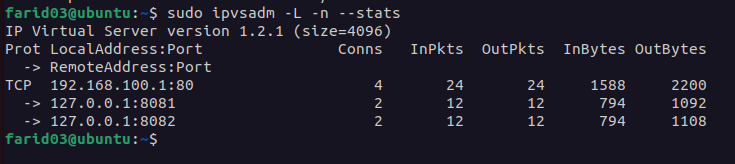

Видно, что запросы равномерно распределяются между серверами благодаря round-robin алгоритму.

---

## Задание 4. Балансировка L7 с помощью NGINX

### 4.1. Настройка NGINX

Создаем конфигурацию для upstream:

```bash
sudo nano /etc/nginx/sites-available/loadbalancer
```

Содержимое конфигурационного файла:

```nginx
upstream backend {
    server 127.0.0.1:8081 max_fails=7 fail_timeout=30s;
    server 127.0.0.1:8082 backup;
}

server {
    listen 127.0.0.1:8888;
    
    location / {
        proxy_pass http://backend;
        proxy_set_header X-high-load-test "123";
        proxy_set_header Host $host;
    }
}
```

Активируем конфигурацию:

```bash
sudo ln -s /etc/nginx/sites-available/loadbalancer /etc/nginx/sites-enabled/
sudo nginx -t
sudo systemctl reload nginx
```

**Скриншот 12:** Конфигурация и перезапуск NGINX

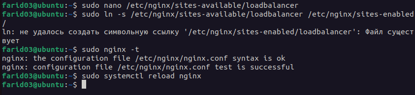

### 4.2. Проверка работы балансировщика

Проверяем работу при активном primary сервере:

```bash
curl http://127.0.0.1:8888
```

**Скриншот 13:** Запрос к работающему серверу

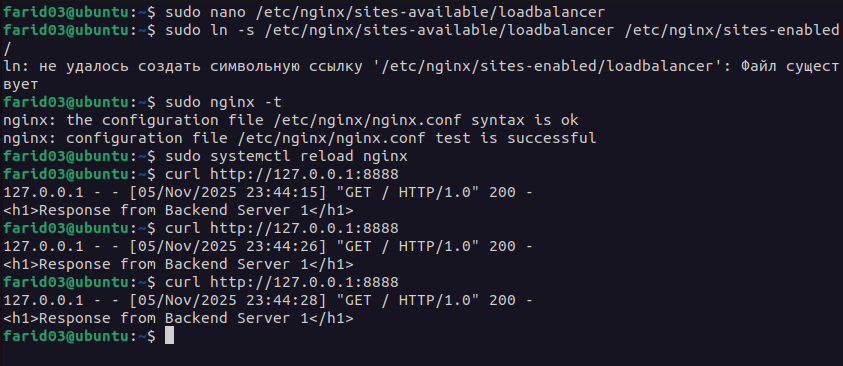

### 4.3. Тестирование переключения на backup

Останавливаем первый сервер:

```bash
# Находим PID процесса на порту 8081
ps aux | grep "8081"
kill <PID>
```

Делаем несколько запросов для имитации неудачных попыток:

```bash
for i in {1..10}; do curl http://127.0.0.1:8888; echo ""; done
```

**Скриншот 14:** Переключение на backup сервер

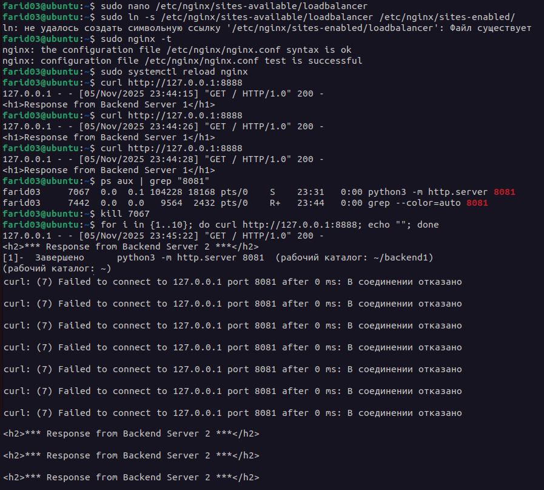

После 7 неудачных попыток NGINX переключается на backup сервер (127.0.0.1:8082).

